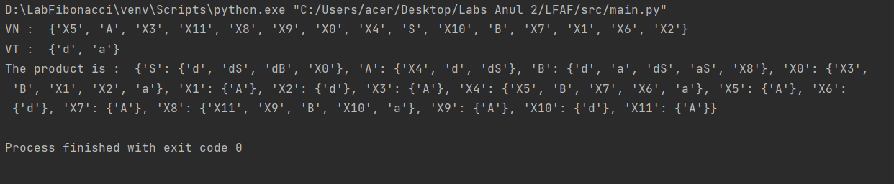

# Topic: Chomsky Normal Form

### Course: Formal Languages & Finite Automata
### Author: Andrei Ceban FAF-211

----

## Theory
&ensp;&ensp;&ensp; Chomsky Normal Form (CNF) is a specific form of a context-free grammar (CFG), which is a set of production rules that define a formal language. In CNF, each production rule is of the form:
    A → BC or A → a
where A, B, and C are nonterminal symbols (symbols that can be replaced by a sequence of symbols) and a is a terminal symbol (a symbol that cannot be replaced).   

&ensp;&ensp;&ensp; To convert a grammar to Chomsky normal form, a sequence of simple transformations is applied in a certain order; this is described in most textbooks on automata theory. The presentation here follows Hopcroft, Ullman (1979), but is adapted to use the transformation names from Lange. Each of the following transformations establishes one of the properties required for Chomsky normal form.

&ensp;&ensp;&ensp; A context free grammar (CFG) is in Chomsky Normal Form (CNF) if all production rules satisfy one of the following conditions:
- A non-terminal generating a terminal (e.g.; X->x)
- A non-terminal generating two non-terminals (e.g.; X->YZ)
- Start symbol generating ε. (e.g.; S-> ε)

&ensp;&ensp;&ensp; The grammar G1 is in CNF as production rules satisfy the rules specified for CNF. However, the grammar G2 is not in CNF as the production rule S->aZ contains terminal followed by non-terminal which does not satisfy the rules specified for CNF.

&ensp;&ensp;&ensp; Algorithm to Convert into Chomsky Normal Form  : 
Step 1 − If the start symbol S occurs on some right side, create a new start symbol S’ and a new production S’→ S.

Step 2 − Remove Null productions. (Using the Null production removal algorithm discussed earlier)

Step 3 − Remove unit productions. (Using the Unit production removal algorithm discussed earlier)

Step 4 − Replace each production A → B1…Bn where n > 2 with A → B1C where C → B2 …Bn. Repeat this step for all productions having two or more symbols in the right side.

Step 5 − If the right side of any production is in the form A → aB where a is a terminal and A, B are non-terminal, then the production is replaced by A → XB and X → a. Repeat this step for every production which is in the form A → aB.


&ensp;&ensp;&ensp; Normalizing a grammar is the process of converting it into a standard form or normal form, which can make it easier to analyze and manipulate the grammar. There are different types of normal forms depending on the type of grammar being used. Normalizing a grammar can be useful for several reasons, such as simplifying the grammar, making it easier to generate or parse sentences in the language, and for theoretical analysis of the grammar's properties.

&ensp;&ensp;&ensp; Chomsky Normal Form (CNF) is a normal form for context-free grammars, as explained in the previous answer. Another normal form for context-free grammars is Greibach Normal Form (GNF), where each production rule is of the form:

A → aB1B2...Bk

where A is a nonterminal symbol, a is a terminal symbol, and B1, B2, ..., Bk are nonterminal symbols. In other words, the right-hand side of each production rule starts with a single terminal symbol followed by any number of nonterminal symbols.

## Objectives:
1. Learn about Chomsky Normal Form (CNF) [1].
2. Get familiar with the approaches of normalizing a grammar.
3. Implement a method for normalizing an input grammar by the rules of CNF.
    1. The implementation needs to be encapsulated in a method with an appropriate signature (also ideally in an appropriate class/type).
    2. The implemented functionality needs executed and tested.
    3. A BONUS point will be given for the student who will have unit tests that validate the functionality of the project.
    4. Also, another BONUS point would be given if the student will make the aforementioned function to accept any grammar, not only the one from the student's variant.


## Implementation description
### remove_unit_productions()
&ensp;&ensp;&ensp; This is a method for removing unit productions from a set of production rules. Unit productions are production rules of the form A -> B, where A and B are non-terminal symbols. The method also removes symbols that are not reachable from the start symbol. It takes the production rules as input and modifies them by removing unit productions and symbols that are not reachable.

```python
def remove_unit_productions(self):
    # Remove unit productions
    reachable = {'S'}
    for symbol in list(self.P):
        productions = list(self.P[symbol])
        for production in productions:
            if len(production) == 1 and production.isupper():
                self.P[symbol].remove(production)
                self.P[symbol].update(self.P[production])
    
    # Find reachable symbols
    changed = True
    while changed:
        changed = False
        for nonterm, productions in self.P.items():
            if nonterm in reachable:
                for prod in productions:
                    for symbol in prod:
                        if symbol in self.VN:
                            if symbol not in reachable:
                                reachable.add(symbol)
                                changed = True
    
    # Remove symbols that are not reachable from the start symbol
    inaccessible = self.VN - reachable
    for nonterm in inaccessible:
        del self.P[nonterm]
        self.VN.remove(nonterm)
```

### remove_inaccessible_symbols()
&ensp;&ensp;&ensp; This function removes any symbols (nonterminals) that are not reachable from the start symbol 'S' in a context-free grammar.
It starts by finding all reachable symbols and then removes the nonterminals that are not reachable from the start symbol.

```python
def remove_inaccessible_symbols(self):
    # Find reachable symbols
    reachable = {'S'}
    changed = True
    while changed:
        changed = False
        for nonterm, productions in self.P.items():
            if nonterm in reachable:
                for prod in productions:
                    for symbol in prod:
                        if symbol in self.VN:
                            if symbol not in reachable:
                                reachable.add(symbol)
                                changed = True
    
    # Remove symbols that are not reachable from the start symbol
    inaccessible = self.VN - reachable
    for nonterm in inaccessible:
        del self.P[nonterm]
        self.VN.remove(nonterm)
```

### convert_long_productions_to_cnf()
&ensp;&ensp;&ensp; This function converts the productions of a context-free grammar into Chomsky normal form, which is a standard form for context-free grammars. It replaces any production with more than two non-terminal symbols with a set of new productions that have only two non-terminals or terminals on the right-hand side.

```python
def convert_long_productions_to_cnf(self):
    # Convert long productions to Chomsky normal form
    new_symbol_index = 0
    for symbol in list(self.P):
        productions = list(self.P[symbol])
        for production in productions:
            if len(production) > 2:
                new_symbol = f'X{new_symbol_index}'
                new_symbol_index += 1
                self.P[new_symbol] = set()
                self.P[new_symbol].add(production[0])
                for i in range(1, len(production) - 1):
                    intermediate_symbol = f'X{new_symbol_index}'
                    new_symbol_index += 1
                    self.P[intermediate_symbol] = set()
                    self.P[intermediate_symbol].add(production[i])
                    self.P[new_symbol].add(intermediate_symbol)
                    self.VN.add(intermediate_symbol)
                self.P[new_symbol].add(production[-1])
                self.P[symbol].remove(production)
                self.P[symbol].add(new_symbol)
                self.VN.add(new_symbol)
```

### remove_epsilon_productions()
&ensp;&ensp;&ensp; This function removes epsilon productions from a context-free grammar. It iterates over all non-terminals and their productions, and removes any production that consists only of the empty string (ε). It also keeps track of the removed productions in a list.

```python
def remove_epsilon_productions(self):
    # Remove epsilon productions
    epsilon_productions = []
    for symbol in list(self.P):
        productions = list(self.P[symbol])
        for production in productions:
            if production == 'ε':
                epsilon_productions.append((symbol, production))
                self.P[symbol].remove(production)
```
## Results


## Conclusions
&ensp;&ensp;&ensp; After doing this laboratory work, i understand that normalizing a grammar is the process of converting it into a standard form or normal form, which can make it easier to analyze and manipulate the grammar. Chomsky Normal Form (CNF) is a specific normal form for context-free grammars, which involves converting each production rule to either have two nonterminal symbols or one terminal symbol. 

&ensp;&ensp;&ensp; CNF has several advantages, including simplifying the grammar and making it easier to analyze, parse, or generate sentences in the language. However, converting a grammar to CNF can sometimes be a complex process, and may not always be possible for some grammars. Nevertheless, normalizing a grammar is an important technique in formal language theory, and can be applied to different types of grammars, depending on their characteristics and requirements.

&ensp;&ensp;&ensp; The time complexity of this process is generally O(n^3), where n is the number of nonterminal symbols in the grammar. However, more efficient algorithms can be used to achieve a better time complexity, such as the CYK algorithm, which has a time complexity of O(n^3 * log n) for converting a CFG to CNF.


## References:
[1] [Chomsky Normal Form Wiki](https://en.wikipedia.org/wiki/Chomsky_normal_form)
