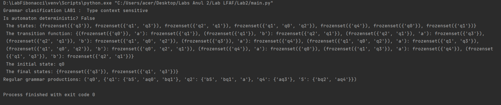

# Topic: Lexer & Scanner
## Course: Formal Languages & Finite Automata
## Author: Andrei Ceban FAF-211

## Theory
&ensp;&ensp;&ensp; The term lexer comes from lexical analysis which, in turn, represents the process of extracting lexical tokens from a string of characters. There are several alternative names for the mechanism called lexer, for example tokenizer or scanner. The lexical analysis is one of the first stages used in a compiler/interpreter when dealing with programming, markup or other types of languages.     

&ensp;&ensp;&ensp; The tokens are identified based on some rules of the language and the products that the lexer gives are called lexemes. So basically the lexer is a stream of lexemes. Now in case it is not clear what's the difference between lexemes and tokens, there is a big one. The lexeme is just the byproduct of splitting based on delimiters, for example spaces, but the tokens give names or categories to each lexeme. So the tokens don't retain necessarily the actual value of the lexeme, but rather the type of it and maybe some metadata.

&ensp;&ensp;&ensp; The process of tokenizing involves breaking up the input stream into distinct pieces that represent the various elements of a programming language, such as keywords, operators, identifiers, and literals. These tokens are then passed on to the next stage of the parsing process, where they are analyzed and interpreted.

&ensp;&ensp;&ensp; The lexer and scanner are critical components of any compiler or interpreter for a programming language. They play a key role in parsing the input code and generating an abstract syntax tree (AST) that can be used by the compiler or interpreter to generate executable code.

&ensp;&ensp;&ensp; The lexer and scannerare fundamental components of the parsing process in a programming language. The lexer takes an input stream of characters and breaks it up into a series of tokens, while the scanner is responsible for identifying the individual tokens in the input stream. Together, they provide the foundation for the compilation or interpretation of a programming language.

## Objectives:

- Understand what lexical analysis [1] is.

- Get familiar with the inner workings of a lexer/scanner/tokenizer.

- Implement a sample lexer and show how it works.

## Implementation description
### get_tokens
&ensp;&ensp;&ensp; This implementation defines multiple regular expressions for matching numbers, left and right parentheses, and the addition, subtraction, multiplication, negation, ratio and division operators. The get_tokens function takes in a string of input code and repeatedly matches the next token based on the regex patterns. When a token is found, it is added to the list of tokens along with its token type The function returns the list of tokens.

```python
    def get_tokens(self):
        tokens = []
        position = 0

        while position < len(self.input_text):
            for character, character_type in TOKENS:

                #to compile a regular expression pattern into a regex pattern object
                regex = re.compile(character)

                # Match the next token based on its regex pattern
                match = regex.match(self.input_text, position)

                #chech if exist any matches
                if match:
                    if character_type:
                        token = (match.group(), character_type)
                        print(token)
                        tokens.append(token)
                    break # put the element in the list and break to go to the next element
            if not match:
                # If we didn't match any token, raise an error
                raise Exception(f"Invalid token ")
            else:
                # If we found a divide operator token, add it to the list and move the position forward
                position = match.end()
        return tokens
```

## Results

## Conclusions
&ensp;&ensp;&ensp; After doing this laboratory work,i understand that a lexer performs lexical analysis, turning text into tokens. Is uses regular expressions to convert each syntactical element from the input into a token, essentially mapping the input to a stream of tokens. A parser reads in a stream of tokens and attempts to match tokens to a set of rules, where the end result maps the token stream to an abstract syntax tree. 
&ensp;&ensp;&ensp; Also i understand that the  lexical analyzer is responsible for removing the white spaces and comments from the source program. It corresponds to the error messages with the source program. It helps to identify the tokens. The input characters are read by the lexical analyzer from the source code.


